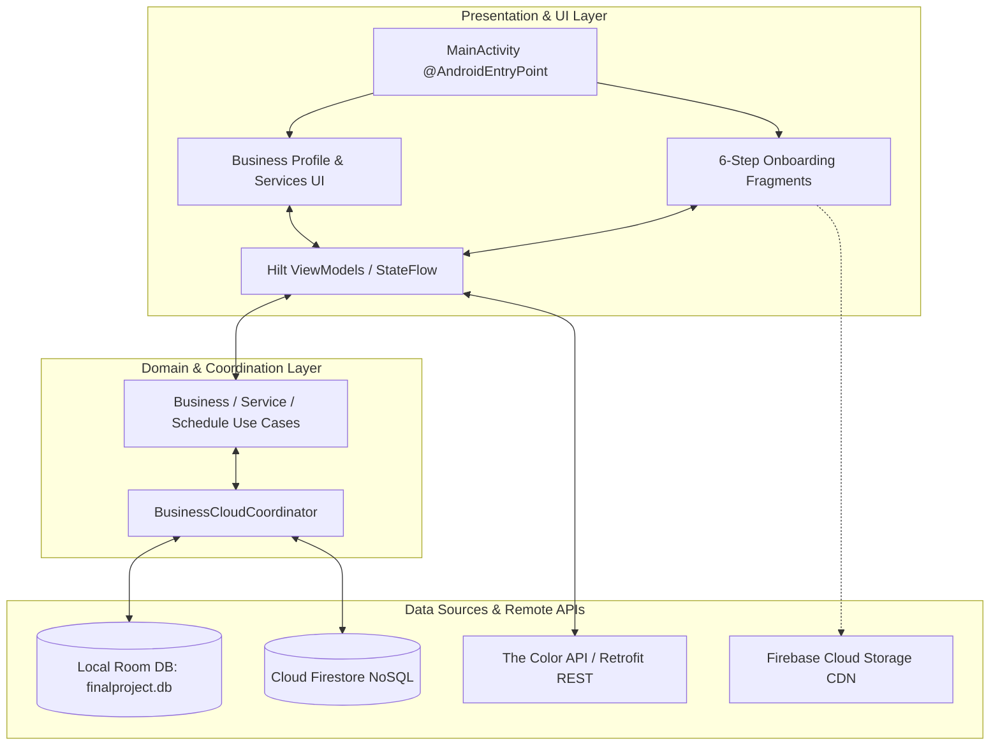
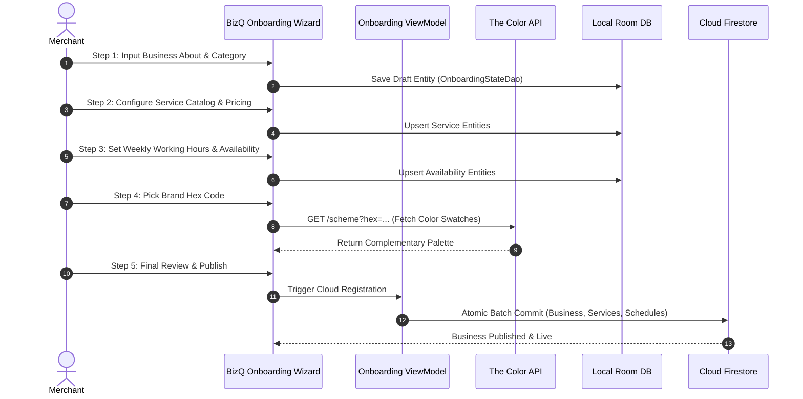

# BizQ (Merchant Platform & Business Onboarding Suite)

[](https://developer.android.com)
[](https://kotlinlang.org/)
[](https://developer.android.com)
[](https://developer.android.com/training/dependency-injection/hilt-android)
[](https://firebase.google.com/docs/firestore)
[](LICENSE)

> Production Android business orchestration platform featuring a 6-step merchant onboarding wizard, dynamic Color API brand palette generation, weekly operational scheduling, service catalog management, and dual-layer Room + Firestore synchronization.

---

## 📖 Overview

**BizQ** is an enterprise Android application engineered for small and medium businesses (SMBs), independent professionals, and commercial service providers. Architected with **Kotlin**, **Dagger Hilt Dependency Injection**, **Clean Architecture**, and **Android Jetpack**, BizQ digitizes business operations by providing a multi-step onboarding funnel, dynamic brand theme generation, interactive weekly scheduling, service catalog authoring, and seamless dual-layer offline-first persistence.

### Core Architectural Pillars
- **6-Stage Guided Merchant Onboarding**: Stepper workflow guiding proprietors through entity categorization, service pricing, operating hours, and brand identity.
- **Dual-Layer Synchronization Coordinator**: `BusinessCloudCoordinator` ensures bidirectional data reconciliation between local **Room SQLite** and remote **Google Cloud Firestore**.
- **Dynamic Color API Theming**: Connects to **The Color API** via Retrofit and Moshi to generate algorithmic complementary color swatches tailored to a merchant's primary brand selection.
- **Granular Availability Matrix**: Configurable weekday schedule planner supporting split shifts, custom business hours, and holiday schedules.
- **Strict Dependency Injection**: Decoupled domain, data, and presentation layers injected via **Dagger-Hilt** modules (`AppModule`, `FirebaseModule`, `RepositoryModule`, `ColorsNetworkModule`).

---

## 🏗️ Architecture & Sync Pipeline



### Merchant Onboarding State Machine



---

## ✨ Core Features

### 1. 🏪 6-Step Merchant Onboarding Funnel
- **Business Identity**: Capture trading name, registration number, contact info, and commercial bio.
- **Category Selection**: Choose from predefined industry verticals or create custom business domains.
- **Service Catalog Builder**: Define service names, descriptions, expected completion times, and prices.
- **Weekly Schedule Matrix**: Interactive day-by-day availability toggles with start and end time pickers.
- **Brand Palette Customizer**: Select primary brand colors with algorithmic palette generation.
- **Verification Gate**: Preview public merchant profiles before deploying to the global marketplace.

### 2. 🎨 The Color API Palette Generator
- **Algorithmic Branding**: Queries The Color API via Retrofit to fetch monochrome, complementary, and analog swatch palettes.
- **Visual Swatch Picker**: Interactive RecyclerView adapter allowing merchants to choose themed accent palettes for their digital storefront.

### 3. 🔄 Dual-Layer Offline-First Architecture
- **Room SQLite Persistence**: Complete local cache allowing merchants to edit services, adjust schedules, and view profiles offline.
- **Cloud Firestore Reconciliation**: `BusinessCloudCoordinator` synchronizes local drafts with cloud documents when network connectivity is established.

### 4. 💉 Dagger Hilt Clean Architecture
- **Modular DI Containers**: Distinct Hilt modules managing Firebase services, Room databases, Retrofit clients, and repository bindings.
- **Testable ViewModels**: Scoped `@HiltViewModel` instances communicating strictly through repository interfaces.

---

## 📱 Key Screens & Navigation Map

| Stage / Fragment | Implementation Class | Description |
|---|---|---|
| **Authentication** | `LoginFragment`, `RegisterFragment` | Secure merchant login, signup, and session recovery. |
| **Step 1: Entity Info**| `BusinessAboutFragment` | Merchant identity, description, address, and contact details. |
| **Step 2: Category** | `BusinessTypeFragment` | Commercial industry selection with tailored operational presets. |
| **Step 3: Services** | `AllServicesFragment` | Dynamic service catalog creation, duration, and price points. |
| **Step 4: Hours** | `AvailabilityFragment` | Weekday operational hours planner and break schedules. |
| **Step 5: Branding** | `BrandingFragment` | Color API swatch selection, logo upload, and banner styling. |
| **Step 6: Completion**| `SetupCompleteFragment`, `BusinessProfileFragment` | Profile preview, launch confirmation, and merchant management hub. |

---

## 🛠️ Technology Stack Matrix

| Layer | Technologies / Libraries |
|---|---|
| **Language & Tooling** | Kotlin 2.0, JDK 17/21, KAPT, Android Gradle Plugin 8.7+ |
| **UI Framework** | Android Jetpack (ViewBinding, Jetpack Navigation 2.8.3, Material 3, RecyclerView) |
| **Dependency Injection**| Dagger Hilt 2.48 (`@HiltAndroidApp`, `@AndroidEntryPoint`, `@HiltViewModel`) |
| **Local Database** | Android Jetpack Room 2.6.1 (SQLite local persistence) |
| **Remote Database** | Google Cloud Firestore NoSQL |
| **Networking & REST** | Retrofit 2.11, OkHttp 4.12, Moshi 1.15 (JSON parsing with KAPT codegen) |
| **Cloud Services** | Firebase Auth, Firebase Storage, Firebase Analytics (BoM 33.7.0) |
| **Background Tasks** | AndroidX WorkManager, Hilt-Work integration |

---

## 🚀 Getting Started

### Prerequisites
- **Android Studio Ladybug (2024.2.1+)** or higher.
- **JDK 17** configured as Gradle JVM.
- **Android SDK 35** installed.
- Active Firebase project with Firestore and Authentication enabled.

### Setup & Installation

1. **Clone the Repository**:
   ```bash
   git clone https://github.com/shayann07/BizQ.git
   cd BizQ
   ```

2. **Configure SDK Location**:
   ```bash
   cp local.properties.example local.properties
   ```
   Add your local Android SDK directory in `local.properties`.

3. **Firebase Credentials**:
   Place your `google-services.json` inside the `app/` directory:
   ```text
   app/google-services.json
   ```

4. **Build & Execute**:
   ```bash
   # Assemble Debug Build
   ./gradlew assembleDebug

   # Run Unit Tests
   ./gradlew testDebugUnitTest
   ```

---

## 📄 License

This project is open-source software licensed under the [MIT License](LICENSE) — Copyright (c) 2026 [shayann07](https://github.com/shayann07).
