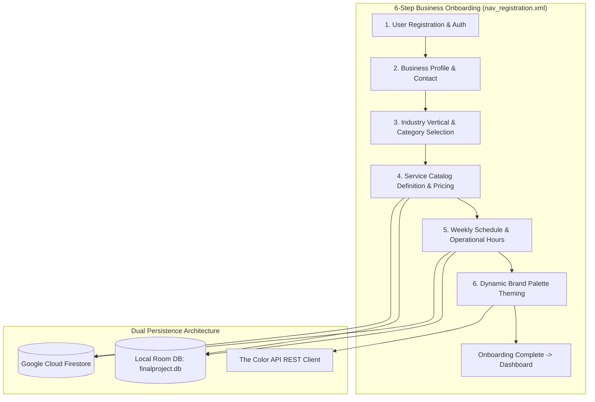

# BizQ — Small Business Onboarding, Service Catalog & Scheduling Android App

[](https://kotlinlang.org)
[](https://developer.android.com)
[](https://gradle.org)
[](https://dagger.dev/hilt/)
[](https://firebase.google.com)
[](LICENSE)

BizQ is a native Android application built in Kotlin with Dagger Hilt dependency injection, Room local persistence, and Firebase Cloud Firestore designed to empower small business owners with automated digital onboarding, service catalog management, weekly appointment scheduling, and dynamic brand theme customization.

---

## Application Architecture & Registration Flow



---

## Key Features

- **6-Step Guided Business Setup**: Seamless stepper wizard guiding proprietors through business metadata, services, business hours, and branding.
- **Dual Storage Architecture**: Offline-first Room database cache (`finalproject.db`) synchronized with Google Cloud Firestore remote cloud repositories.
- **Dynamic Brand Theming**: Integrated client for **The Color API** fetching complementary color schemes and swatches based on the user's primary brand selection.
- **Weekly Schedule & Availability Matrix**: Interactive time-slot pickers allowing businesses to customize opening and closing hours per weekday.
- **Cloud Media Uploads**: Integrated image picking and Firebase Cloud Storage pipeline for business logos and banner media.

---

## Technical Stack

| Component | Library / Framework | Version |
|---|---|---|
| **Language** | Kotlin | 2.0.21 |
| **Build System** | Android Gradle Plugin / Gradle | 8.12.2 / 8.13 |
| **SDK Levels** | Compile SDK: 35, Target SDK: 35, Min SDK: 24 | Android 7.0+ |
| **Dependency Injection** | Dagger Hilt + KAPT | 2.48 |
| **Local Database** | AndroidX Room (Runtime, KTX, Compiler) | 2.6.1 |
| **Cloud Services** | Firebase Auth, Cloud Firestore, Cloud Storage, Analytics | Firebase BoM 33.7.0 |
| **Networking & HTTP** | Retrofit 2 + Gson Converter + Moshi + OkHttp Logging | 2.11.0 / 4.12.0 |
| **Image Loading** | Bumptech Glide | 4.16.0 |

---

## Setup & Local Development

### Prerequisites
- Android Studio Ladybug (2024.2.1+) or newer
- JDK 17 / Java 11 runtime
- Android SDK 35 installed

### Step-by-Step Configuration

1. **Clone the Repository:**
   ```bash
   git clone https://github.com/shayann07/BizQ.git
   cd BizQ
   ```

2. **Configure Firebase Credentials:**
   Copy the example configuration template:
   ```bash
   cp app/google-services.json.example app/google-services.json
   ```

3. **Configure Local SDK:**
   ```bash
   cp local.properties.example local.properties
   ```

4. **Build the Application:**
   ```bash
   ./gradlew assembleDebug
   ```

---

## Repository Structure

```
BizQ/
├── app/
│   ├── src/main/
│   │   ├── java/com/example/finalproject/
│   │   │   ├── App.kt                  # @HiltAndroidApp application entrypoint
│   │   │   ├── data/                   # Models, Room DAOs, and Firebase Repositories
│   │   │   ├── di/                     # Hilt Modules (AppModule, RepositoryModule, NetworkModule)
│   │   │   └── ui/                     # Registration flow fragments, ViewModels, Adapters
│   │   ├── res/                        # Layouts, navigation graphs (my_nav, nav_registration)
│   │   └── AndroidManifest.xml         # Package queries, permissions
│   ├── google-services.json.example
│   └── build.gradle.kts
├── local.properties.example
├── LICENSE                             # MIT License
└── README.md
```

---

## License

Distributed under the MIT License. See [LICENSE](LICENSE) for more information.

Copyright (c) 2026 **shayann07**
